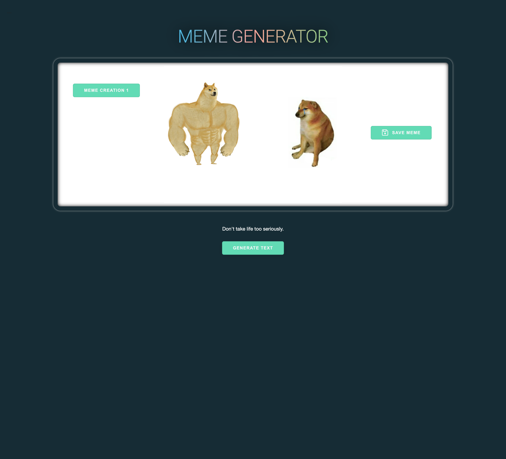
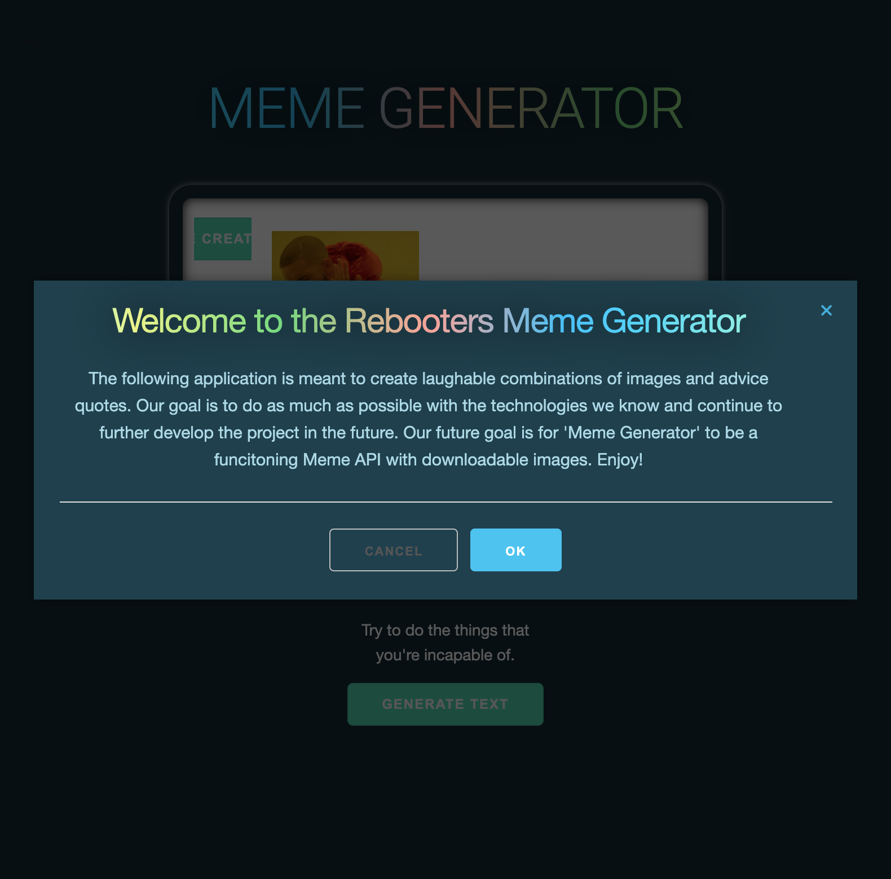
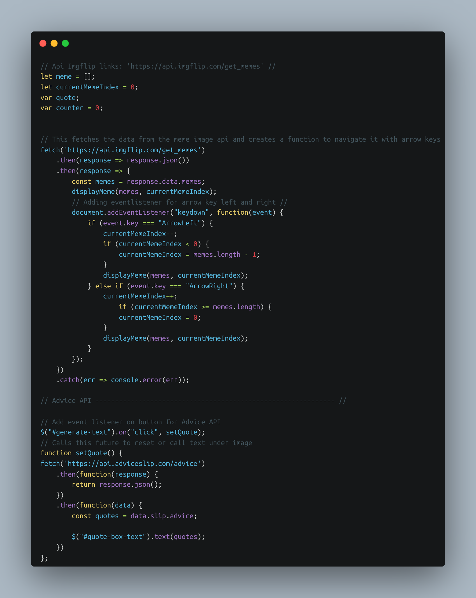
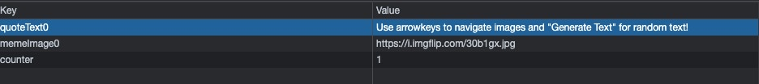

# Project-1: Meme Generator :trollface: 

## Description

This is a web application featuring our first project for the Georgia Tech Coding Bootcamp. This project is a meme generator using two server-side APIs: a random meme image generator and a random funny advice text generator. We used both of the APIs to combine into a image/text meme generator that a user can save to local storage to retrieve at a later time. This application is styled using an external stylesheet called Skeleton CSS. This is applied similar to Bootstrap but a second stylesheet is added along with the vanilla CSS to use as a library to add basic formatting to the HTML. These requirements applied together create a well-rounded front end web application that uses modal messages, is responsive to most devices, and has accessible coding practices.

This application is also an example of a continuation project. The frameworks and knowledge we are using now is not expansive enough to apply more complicated and interactive features to the application. However, this project can be updated at a later date once the back end curriculum is accessed to add features such as: top and bottom text addition, personal text area for user to type whatever they want, saving text on top of images into one item, and general and customizable meme creation.

## Tasks completed 

- Use a CSS framework over than Bootstrap: Skeleton CSS
- Create a front end application that is interactive and will react to user input
- Use two server-side APIs
- Do not user alerts or messages through the browser to make application modal
- Use client-side storage to store persistent data
- Make the application repsonsive to an array of devices
- Apply code to make the application have a polished user interface
- Have a clean repository, coding practices, and properly deployed page

## Link :link:

[Link to deployed website]()

[Link to Repository](https://github.com/cbarnes0/Meme-Generator/tree/main)

## Installation

Access application through github by deploying index.html, style.css, skeleton.css, javascript, and README.md

Links above bring user to deployed page and github repository

## Usage

This application is used to create personal memes using random meme images and funny advice text. These two APIs are combined and saved under one item to local storage to be accessed whenever the user wants. These saves to local storage can be accessed through buttons in the web page. This is used purely as entertainment and meme creation for social media usage.

Home Page

Modal Message

## Fetching API

## Local.Storage

## Credits

Credit for the total completion of assignment include: TAs, instructor, and students of the 2022 Georgia Tech Coding Bootcamp. Their assistance allowed for the assignment to meet all requirements.

### Members

| Members | GitHub |
| ------- | ------ |
| Carson Barnes | [https://github.com/cbarnes0] |
| Tien Ton | [https://github.com/TimothyLai1121] |
| Aaron Dreyer | [https://github.com/AaronDreyer] |
| Zackery Bennett | [https://github.com/zack7-ai] |

### Resources

| Websites | Urls |
| -------- | ---- |
| StackOverflow | [https://stackoverflow.com/] |
| Skeleton.css | [http://getskeleton.com/] |
| ImgFlip | [https://imgflip.com/memegenerator] |
| Mamke Meme | [https://makeameme.org/memegenerator] |
| Api Meme | [https://apimeme.com/] |
| Shield.io | [https://shields.io/] |
| Carbon | [https://carbon.now.sh/] |

### API Resources

| API's name | API's URL |
| ---------- | --------- |
| Advices Slip | [https://api.adviceslip.com] |
| Get Memes | [https://api.imgflip.com/get_memes]